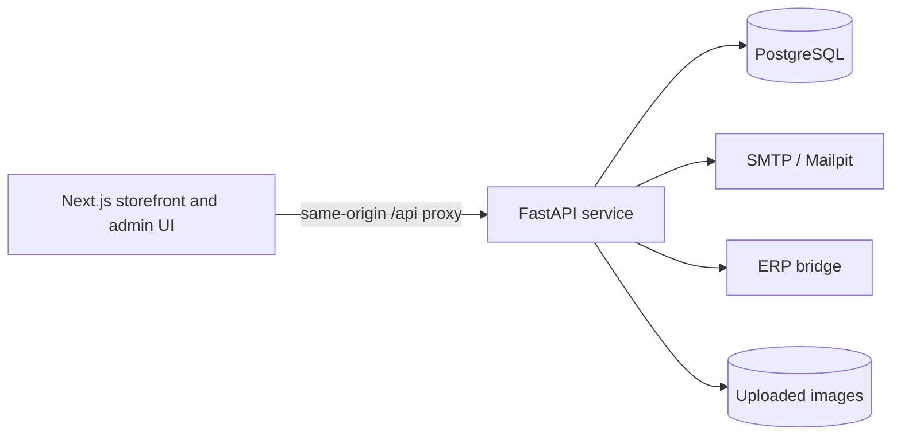

# PILOT Auto Parts Platform

[](https://github.com/Lisovtcoff-hub/pilot-autoparts-platform/actions/workflows/ci.yml)

A full-stack ordering platform for a local auto-parts store. Customers can browse stock, place pickup orders and track their status. Store employees use a protected dashboard to manage products, process orders and synchronize inventory with an external ERP bridge.

## Highlights

- Transactional order workflow with explicit status transitions
- Idempotent order creation to prevent duplicate submissions
- Inventory reservation and restoration under database row locks
- HttpOnly admin sessions with production credential validation
- Product image uploads with size, MIME and file-signature checks
- Email notifications through SMTP, with Mailpit included for local testing
- Pluggable catalog provider for mock data or an external ERP bridge
- PostgreSQL migrations with Alembic and automated backend/frontend CI

## Architecture



The repository contains one server-side application: FastAPI is the source of truth for products, orders, authentication and settings. Next.js is responsible only for the user interface and proxies `/api/*` requests to the backend.

## Technology

- **Backend:** Python 3.12, FastAPI, SQLAlchemy 2, Alembic, Pydantic
- **Database:** PostgreSQL; SQLite is used by the test suite
- **Frontend:** Next.js 16, React 19, TypeScript
- **Infrastructure:** Docker Compose, Mailpit, GitHub Actions
- **Testing:** Pytest, pytest-asyncio, Ruff, ESLint, Next.js production build

## Local development

```bash
cp .env.example .env
docker compose up --build
```

Services:

- Storefront: `http://localhost:3000`
- Admin dashboard: `http://localhost:3000/admin`
- OpenAPI documentation: `http://localhost:8000/docs`
- Mailpit: `http://localhost:8025`

Local credentials come from `.env`. Change `ADMIN_PASSWORD` and `SESSION_SECRET` before sharing the environment.

## Run without Docker

Backend:

```bash
cd backend
python -m venv .venv
source .venv/bin/activate
pip install -e '.[dev]'
alembic upgrade head
uvicorn app.main:app --reload
```

Frontend, in another terminal:

```bash
npm ci
npm run dev
```

`BACKEND_INTERNAL_URL` defaults to `http://localhost:8000` during local Next.js development.

## Tests and checks

```bash
cd backend
ruff check app tests
pytest

cd ..
npm run lint
npm run build
```

CI also applies the full Alembic migration chain to a clean PostgreSQL database.

## Order lifecycle

```text
new → confirmed → ready → completed
  └──────────────→ cancelled
       confirmed/ready cancellation restores inventory
```

An order is created without immediately decrementing stock. Confirmation reserves inventory, and cancellation from a reserved state restores it. Invalid transitions return `409 Conflict`.

## ERP integration

`CatalogProvider` defines the integration boundary. The included implementations are:

- `MockCatalogProvider` for local development
- `InfoEnterpriseProvider` for an outbound bridge installed near the store ERP

The bridge URL and token are managed from the admin dashboard. Tokens are write-only: the API never returns the stored secret to the browser.

## Production notes

Set `APP_ENV=production`, use HTTPS, enable `COOKIE_SECURE`, and provide strong values for `ADMIN_PASSWORD` and `SESSION_SECRET`. The backend refuses to start in production with placeholder credentials. Put rate limiting for login and public order-status endpoints at the reverse proxy or gateway.

See [docs/architecture.md](docs/architecture.md) and [docs/deployment.md](docs/deployment.md) for additional details.
